# IOTFast 物联网快速开发平台

在选购物联网产品相关的时候，大部分的产品都只能是使用厂家指定的平台，无法实现不同的产品不同的平台互联互通，比如小米的产品无法接入带自家的系统里面等，总是会有这样那样的限制。正是由于这么多的限制，因此打算建立一个全新的物联网生态联盟，在该联盟里面的厂家可以在设备里面实现自身的协议或者可以将该平台集成到设备里面去，从而实现设备不受限制的互联互通，后面也会建立起一个平台，在该平台上大家可以贡献自己制作的插件，从而实现躺着收费的梦想，平台上厂家也可以上线自己的设备，从而省去昂贵的广告费用，可以让利给消费者，从而让消费者可以买到便宜实用的产品。

IOTFast平台是基于Goframe2.0 + vue3.x + CompositionAPI + typescript + vite + element plus + vue-router-next + next.vuex 等开发，适配电脑PC,手机，平板的物联网平台，该平台可以运行于多种平台上面，支持跨平台的物联网接入及管理方案，独创的GO插件系统，支持跨语言，跨平台接入，为后期的系统扩展打下了坚实的基础。该平台实现了众多的web技术开发和物联网开发相关的基础功能，基于该功能可以快速的搭建起一整套的业务系统。

## 核心特性
* 支持多种物理模型，多种设备，厂家同意管理。
* 屏蔽网络协议的复杂性，适配多种接入协议(TCP,MQTT,UDP,CoAP,HTTP,GRPC,RPC等),灵活接入不同厂家的不同设备。
* 支持跨平台运行，能运行于树莓派系统，openwrt系统，快速实现边缘计算功能，实现离线自动预警，自动执行等相关功能。
* 支持跨终端展示，可以通过PC,手机，平板等进行设备状态的监控和数据展示
* 独创的插件系统，支持跨语言接入，可以通过C/C++,Python编写的插件进行快速接入。
* 插件系统支持热插拔，支持Modbus tcp,modbus rtu,modbus ascii,iec61850,opc等数据采集协议
* 强大的生态系统支持，目前该平台已经联系多个厂家进行设备的接入，后期将会上线插件商城，设备商城，实现对插件的动态话扩展实现更多的功能。
* 支持厂家接入该系统，所有接入该厂家的系统，都可以在设备商城上上架设备产品，实现一站式购买，一站式接入，不在受限于大公司大平台。
* 官方QQ群：560497341

# 帮助文档
 暂时没有时间来完善文档，大家可以暂时先使用[wiki](https://github.com/xiaodingding/iotfast/wiki "https://github.com/xiaodingding/iotfast/wiki") <https://github.com/xiaodingding/iotfast/wiki> 过渡一下。

# 技术栈
- 1.vue3.x 
- 2.typescript 
- 3.vite 
- 4.element plus
- 5.goframe
- 6.sqlite
- 7.mysql
- 8.redis

# 个人博客
- <a href="https://www.ddsiot.cn/" target="_blank">ddsiot</a>

# ❤️ 鸣谢列表
- <a href="https://gitee.com/lyt-top/vue-next-admin" target="_blank">vue-next-admin</a>
- <a href="https://github.com/gogf/gf" target="_blank">goframe</a>
- <a href="https://github.com/gogf/gf-cli" target="_blank">goframe cli tools</a>
- <a href="https://gitee.com/tiger1103/gfast/tree/os-v3/" target="_blank">gfast</a>
- <a href="https://github.com/DrmagicE/gmqtt" target="_blank">gmqtt</a>

# 采集器实现计划
* MODBUS RTC 最近一个星期
* MODBUS TCP 最近两个星期
* MODBUS ASCII 最近一个月
* IEC61850  最近半年
* OPC 最近半年 

# 功能完善计划
* HTTP数据接入已完成
* MQTT协议数据接入已完成
* MQTT协议设备控制 最近一个月完成

# 使用手册
* 平台使用说明：最近2个月完成
* 接入协议说明：最近3个月完成

# 网页截图
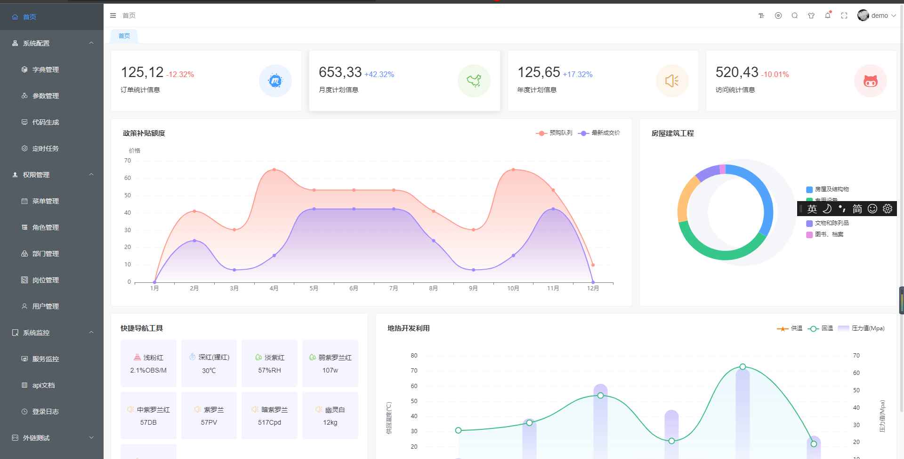

# MQTT客户端接入状态
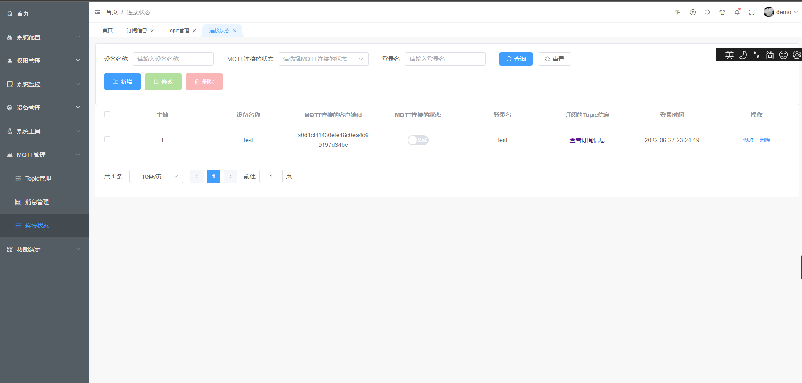

# MQTT客户端订阅topic列表
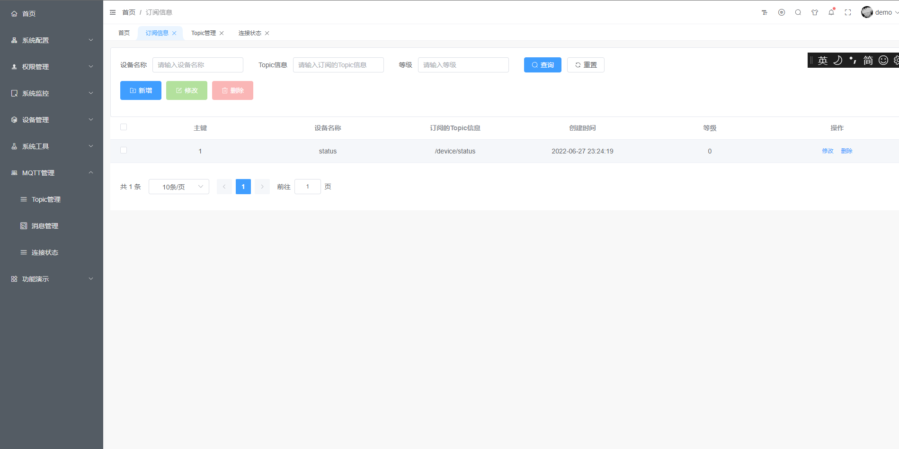

# MQTT客户端消息列表
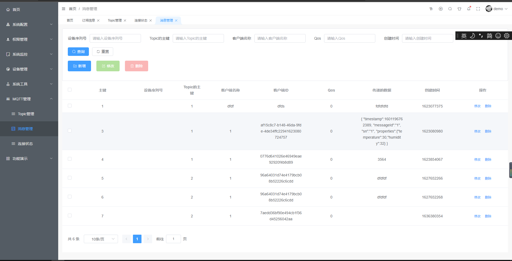

# 设备信息展示
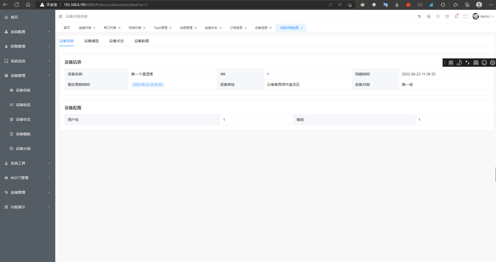

# 设备模型展示
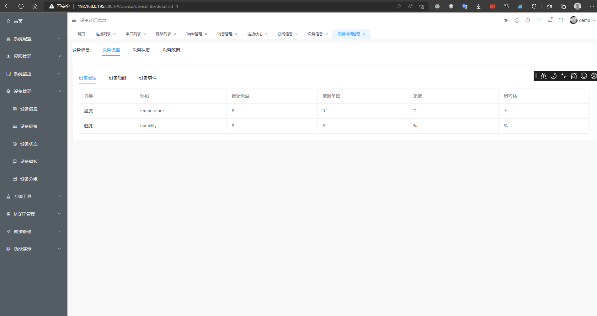

# 设备数据展示
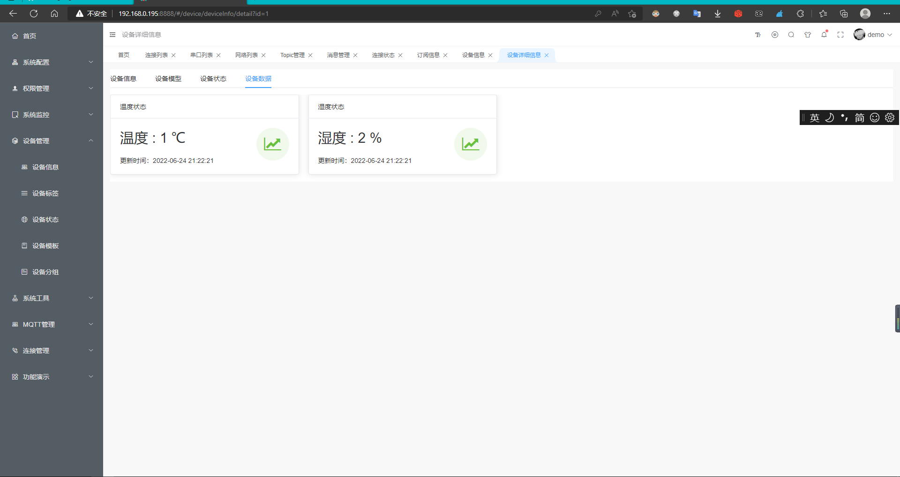

# 串口采集配置
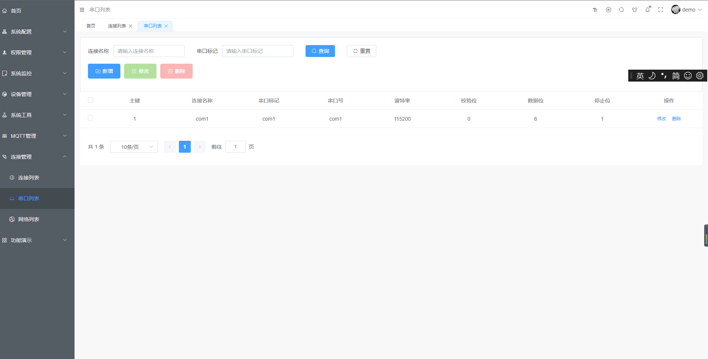

# 网络采集配置
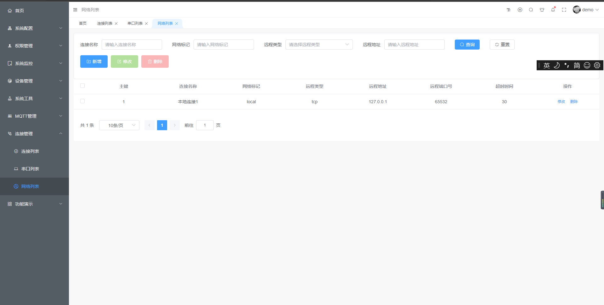

# 设备历史数据展示
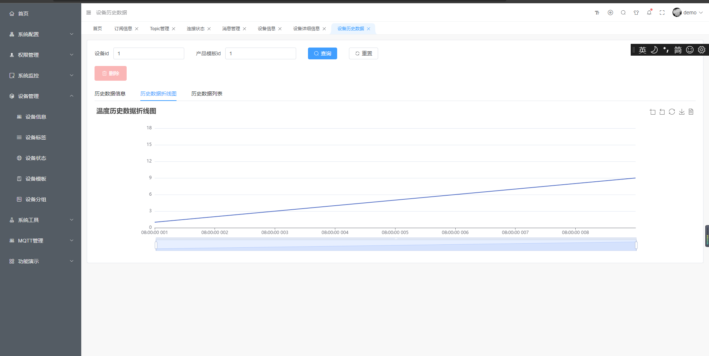

# 软件开发目标及开发计划
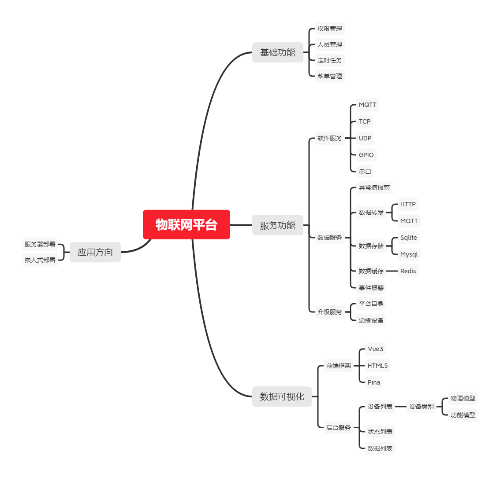

# 系统架构
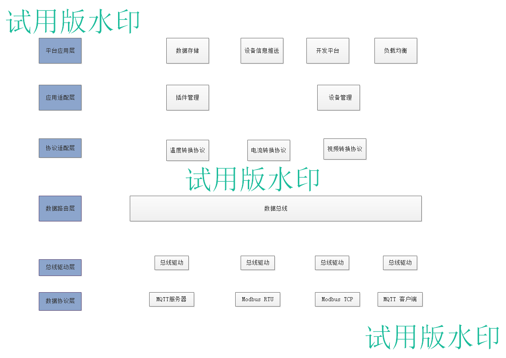

# WEB服务架构
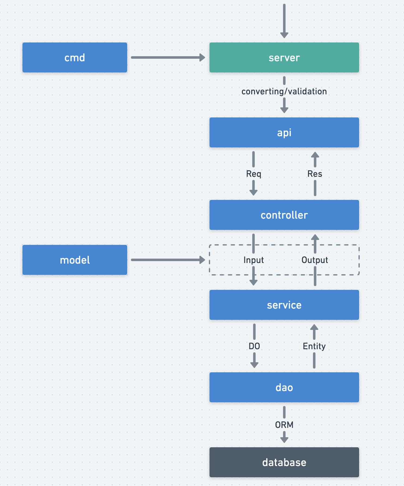
